# Разработка системы оптово-розничной продажи товаров

## Структура проекта

- [Диаграмма прецедентов](precedent.puml)
- [Карта диалоговых окон](map.puml)
- [Карта диалоговых окон для оффлайн-работы](map-local.puml)
- [Фото карты диалоговых окон](map.png)
- [Сами интерфейсы](interface/)
- Внутри файлов есть ссылки на картинки с получившимися диаграммами
- [База SQLite](db.db)
- [Миграции для базы](migrations/)
- [Найстройка окружения для корректного применения миграция](.env)
- [Mermaid-диаграмма Базы](diagram.mermaid)

## Как делать работу?

Диаграммы делаем при помощи Plant UML (`.puml`)
Интерфейс при помощи QML

1. Создаем диаграмму прецедентов
2. Для каждого прецедента создаем интефейс
3. Создать карту диалоговых окон, которая соединит интерфейсы
4. Сделать текстовые описания для каждого прецедента
5. Придумать форматы хранения данных

## Ссылки

[Plant UML](https://habr.com/ru/articles/279373/)
[QML](https://habr.com/ru/articles/669692/)
[Сайт Plant UML](https://plantuml.com/ru-dark/use-case-diagram)

## Текст задания (Вариант 4)

Оптово-розничная продажа товаров. Компания торгует товарами из определенного спектра. Каждый товар характеризуется наименованием, оптовой ценой, розничной ценой и справочной информацией. В компанию обращаются покупатели, для каждого из которых в базе данных фиксируются стандартные данные (наименование, адрес, телефон, контактное лицо). По каждой сделке составляется документ, в котором наряду с покупателем фиксируются количество купленного им товара и дата покупки. Обычно покупатели в рамках одной сделки покупают не один товар, а сразу несколько. Также компания решила предоставлять скидки в зависимости от количества закупленных товаров и их общей стоимости.

## Несколько команд

- Поднять собственный сервер PlantUML: `docker run -d -p 8080:8080 plantuml/plantuml-server:jetty`
  - Установите Docker: `brew install --cask docker`
- Применить миграции к базе: `sqlx database reset -y`
  - Установите sqlx-cli: `cargo install sqlx-cli`

## Диаграмма базы данных

```mermaid
erDiagram
    USER {
        integer id
        text username
        text user_type
        text created_at
    }
    
    STORE {
        integer id
        text name
        text location
        text created_at
    }
    
    ITEM {
        integer id
        text name
        text description
        text created_at
    }
    
    USER_STORE {
        integer id
        integer user_id
        integer store_id
        text created_at
    }
    
    ITEM_STORE {
        integer id
        integer item_id
        integer store_id
        integer amount
        text created_at
    }
    
    USER_STORE }o--|| USER : "user_id"
    USER_STORE }o--|| STORE : "store_id"
    ITEM_STORE }o--|| ITEM : "item_id"
    ITEM_STORE }o--|| STORE : "store_id"
```

